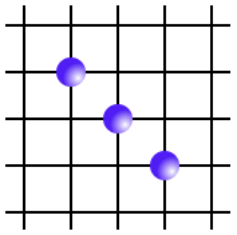
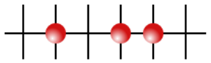

# Subject

 

*Summary: The goal of this project is to make an AI capable of beating human players at Gomoku.*

 

## I - Introduction

---

 

[Gomoku](https://en.wikipedia.org/wiki/Gomoku) is a strategy board game traditionally played on a [Go](https://en.wikipedia.org/wiki/Go_%28game%29) board with stones of two different colors.

 

## II - General guidelines

---

 

In the context of this project, you will play with the following additional rules:

 

- Two players take turns placing stones of their color on an intersection of the board, and the game ends when one player manages to align five stones. Sometimes, only an alignment of 5 can win, and sometimes 5 or more is okay. In the context of this projet, we will consider 5 or more to be a win.

 

- There are different interpretations on what the board size for Gomoku should be.
In the context of this project, Gomoku will be played on a 19x19 Goban, without limit to the number of stones.

 

- There are a great many additional rules to Gomoku (Google it!) aimed at making the game more fair (regular Gomoku is proven to be unfair, a perfect first player wins 100% of the time) and more interesting.

 

- Capture (As in the Ninuki-renju or Pente variants) : You can remove a pair of your opponent’s stones from the board by flanking them with your own stones (See the appendix). This rule adds a win condition : If you manage to capture ten of your opponent’s stones, you win the game.

 

- Endgame Capture:

 

		◦ A player who manages to line up five stones wins only if the opponent cannot break this line by capturing a pair.
		◦ If the player has already lost four pairs and the opponent can capture one more, the opponent wins by capture.
		◦ If there is no possibility of this happening, there is no need to continue the game.

 

- No double-threes : It is forbidden to play a move that introduces two free-three alignments, which would guarantee a win by alignment (See the appendix).

 

- You are free to use whatever language and graphical interface library you want.

 

- Your program should not crash in any circumstances (even when it runs out of memory), and should not quit unexpectedly. If it happens, your project will be considered non-functional and your grade will be 0.

 

- You have to provide a Makefile which must produce your program. It must not
relink.

 

- Your Makefile must at least contain the rules: $(NAME), all, clean, fclean and re.

 

> ℹ️ Although you must keep in mind that while there will not be a grading scale on the time/space performance of your AI relative to others (We’ll see about that kind of thing later on), if your AI takes more than half a second (in average) to find a move, you will not validate the project. That’d be bad, wouldn’t it ? Also, you must still keep performance for its own sake in mind : You will not get all the points if your implementation wins too slowly, or if your implementation seems lazily done (Low search depth, naive
implementation, etc...)

 

## III - Mandatory part

---

 

You must write a program that lets you play Gomoku (with the rules specified previously):

 

- The executable must be named Gomoku.

 

- Against your program : The most interesting case, of course. The goal here is that the program wins the game, without you letting it win. It must be able to adapt its strategy to the player’s moves.

 

- Against another human player on the same computer (hotseat), but with a movesuggestion feature. Easy to do once you have made a whole computer player.

 

The AI will, basically, generate a possible-solution tree, and choose the best move according to this tree. You have to use a Min-Max algorithm for this. While this is rather easy in itself, since these algorithms are well-documented and you pretty much only have to implement them, for them to actually be useful, you need an efficient heuristic function to evaluate the value of a terminal node in your tree. You will have to experiment and refine it until it is sufficiently accurate while remaining fast enough. Don’t be fooled : The heuristic is actually the hardest part. 

 

You must also provide a usable graphical interface to allow one to actually play Gomoku. After all, while the AI is the main focus here, your game still has to be playable. You’re free to use whichever graphical or ncurses-like library you want for this, as long as the end result is at least vaguely pleasing to the eye, and is easily playable.

 

Also, it would be a very good idea to implement some sort of debugging process that lets you examine the reasoning process of your AI while it’s running. Not only would it be helpful to refine your AI’s tactics, but it would help during your defense sessions, since you will have to actually explain how it works.

 

Last point: You have to display, somewhere in your user interface:

 

- A timer that counts how much time your AI takes to find its next move.

 

⚠️ This is so your grader can precisely evaluate the performance of your AI. And yes: No timer, no project validation. It’s that serious.

 

## IV - Bonus part

---

 

When you’re finished, why not implement the possibility of choosing the game rules you want to apply when you start a game ? There are a LOT of possibilities.

 

You can especially look at starting conditions (Standard, Pro, Swap, Swap2...).

 

Of course, any other bonus you can think of that is actually interesting and or useful will be taken into account.

 

⚠️ The bonus part will only be assessed if the mandatory part is PERFECT. Perfect means the mandatory part has been integrally done and works without malfunctioning. If you have not passed ALL the mandatory requirements, your bonus part will not be evaluated at all.

 

## V - Appendix

---

 

### 1. Captures

 

Captures are made by flanking a pair of the opponent’s stones, as demonstrated below :

 

	

 

In this scenario, by playing in a, Blue captures the red pair and removes the stones from the game. The now-free intersections can be played on as if they were never occupied.

 

One can only capture PAIRS, not single stones, and not more than 2 stones in a row.

 

Also note that one can not move into a capture. Example :

 

	

 

In this scenario, Red can play in a without losing the pair. However, if later Red takes one of the Blue stones, his position becomes vulnerable to capture...

 

### 2. Free-threes

 

A free-three is an alignement of three stones that, if not immediately blocked, allows for an indefendable alignment of four stones (that’s to say an alignment of four stones with two unobstructed extremities).

 

Both of these scenarios are free-threes:

 

	

 

	

 

A double-three is a move that introduces two simultaneous free-three alignments. This is an indefendable scenario.

 

Example:

 

	

 

In this scenario, by playing in a, Red would introduce a double-three, therefore this is a forbidden move. However, if there were a blue stone in b, one of the three-aligned would be obstructed, therefore the move in a would be legal.

 

⚠️ It is important to note that it is not forbidden to introduce a double-three by capturing a pair.